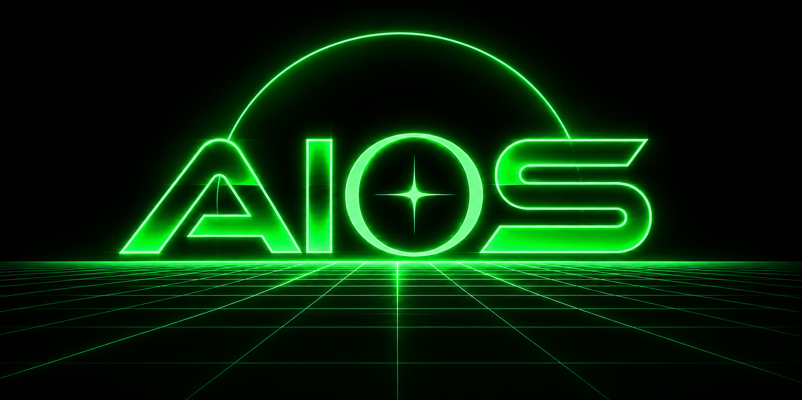

# AIOS

**Persistent cognition, memory, and world state for AI agents.**

AIOS gives long-running AI characters and agents continuity beyond a single prompt or chat. It remembers events, tracks changing world state, maintains what individual characters know and believe, preserves durable identity, acquires external knowledge, and retrieves the context that matters for the current moment.

Instead of treating memory as a pile of old text, AIOS maintains persistent state and produces a focused **HUD** for the active agent.

AIOS can also coordinate agent tasks and actions and accept inference capacity from compatible LLM endpoints.

**Want to try it without installing anything?**
Open the [AIOS Google Colab demo](https://colab.research.google.com/drive/1c-eaLVuAu76JSgD4-rr65WvPFwzXA1zK?usp=sharing).

> **Status:** AIOS is experimental and under active development.
>
> **License:** AIOS is source-available proprietary software for personal use by natural persons. See the [AIOS Personal Use License 1.0](LICENSE).

## Run AIOS

AIOS requires:

* Python 3.10 or newer
* Docker with Docker Compose v2
* Git

```bash
git clone https://github.com/LeetHappyfeet/AIOS.git
cd AIOS
bash setup.sh
```

The setup script:

* starts PostgreSQL, Qdrant, and Apache Jena Fuseki;
* creates the Python virtual environment;
* installs AIOS dependencies and the required spaCy model;
* loads the AIOS ontology;
* initializes the PostgreSQL database;
* applies current migrations;
* verifies the installation.

When setup completes, start AIOS with:

```bash
bash run.sh
```

A healthy startup ends with:

```text
✅ AIOS READY
   Required services: 4/4 ready
```

Open the web interface at:

```text
http://127.0.0.1:7860
```

The API is available at:

```text
http://127.0.0.1:8000
```

Verify the API with:

```bash
curl http://127.0.0.1:8000/healthz
```

Expected response:

```json
{"ok":true}
```

Press `Ctrl+C` to stop the native AIOS processes.

To also stop PostgreSQL, Qdrant, and Fuseki:

```bash
bash stop.sh
```

Stored AIOS data remains in persistent Docker volumes. Do not use `docker compose down -v` unless you intentionally want to erase those databases.

Optional infrastructure settings are documented in `.env.example`.

See [docs/installation.md](docs/installation.md) for installation details and troubleshooting.

## What Does AIOS Maintain?

AIOS separates several kinds of persistent state that ordinary retrieval systems tend to mix together.

**Identity** describes who a character is. It is durable, versioned, provenance-backed, and deliberately difficult for ordinary conversation to rewrite.

**Experience** records what happened. AIOS can represent individual event occurrences and combine related events into episodes without throwing away the original evidence.

**Knowledge and belief** represent what a particular character knows, remembers, or currently accepts. Two characters can inhabit the same world without automatically sharing the same information.

**World state** represents shared information and concrete runtime state independently of private character cognition.

**Scene state** maintains the immediate situation around a character independently of long-term memory.

**The HUD** selects the useful portion of this state for the active agent at the current point in the world and timeline.

## Knowledge Acquisition

AIOS can ingest external material and turn it into character-accessible knowledge while preserving its source and provenance.

A shared corpus can contain documents and web material without automatically giving every character access to everything it contains. AIOS can associate material with knowledge domains and track what a character has actually acquired.

This allows external research and learned information to enter the same persistent knowledge system used by conversation and experience.

## Agents and Inference

AIOS includes a runtime for persistent agent tasks and actions.

Agents can maintain work across individual generations instead of requiring every operation to begin and end inside one prompt. Actions can be handled deterministically where appropriate or delegated to an LLM when reasoning is required.

AIOS can accept inference workers through compatible LLM endpoints. Inference capacity is separate from persistent state: AIOS memory and knowledge remain available whether or not an external LLM worker is connected.

These systems are new and remain experimental.

## Why Not Just RAG?

Traditional RAG usually asks:

```text
What stored text is similar to this prompt?
```

AIOS also needs to ask:

```text
What happened?
Was this the same event or a different occurrence?
Which world did it happen in?
What does this character know?
What does this character believe?
What has this character learned?
What belongs to public world knowledge?
Who is this character supposed to be?
What is happening right now?
What is relevant right now?
```

Vector search is useful inside AIOS, but similarity does not decide truth, chronology, identity, world ownership, or character knowledge.

A simplified view is:

```text
conversation / observations / external knowledge
                     ↓
          persistent AIOS state
                     ↓
       character knowledge + belief
                     ↓
        scene state + relevant recall
                     ↓
                    HUD
                     ↓
             agent / LLM / human
                     ↓
              tasks + actions
                     ↓
               new observations
```

The larger state remains persistent even though only a small portion is placed into an active prompt.

## Character Identity

AIOS maintains character identity separately from ordinary memory.

Character cards and other reference sources can provide identity material, but imported material passes through a provenance-backed identity layer rather than becoming runtime memory.

Accepted identity is compiled into a deterministic **Identity Kernel** shared by instances of the same character.

This prevents a remembered conversation, temporary mood, contradictory source, or stray observation from silently redefining who the character is.

See [docs/identity_kernel.md](docs/identity_kernel.md) for the identity architecture.

## Client Integration

The normal live-agent flow is:

```text
POST /session
        ↓
POST /character/{character_id}/activate
        ↓
POST /ingest
        ↓
POST /instance/{instance_id}/hud
        ↓
structured frame + rendered HUD context
```

The HUD is the primary generation-facing boundary. Clients do not need to understand the underlying PostgreSQL schema, RDF graphs, semantic topology, or retrieval system.

The [MemoryVaultIngest SillyTavern extension](https://github.com/LeetHappyfeet/extension-MemoryVaultIngest) is one example of a live AIOS client.

AIOS also exposes APIs for world state, character knowledge, documents, epistemic search, identity management, agent actions, knowledge acquisition, and inference workers.

## Architecture

AIOS currently uses:

**PostgreSQL** for durable memory, provenance, timelines, character/world state, cognition, belief state, events, episodes, knowledge acquisition, agent state, and pipeline state.

**Apache Jena Fuseki** for RDF semantic representations of world and character knowledge.

**Qdrant** for semantic candidate discovery and retrieval acceleration.

**AIOS runtime services** for ingestion, semantic processing, cognition, retrieval, character/world runtime, HUD assembly, agent actions, and inference coordination.

The storage systems have different responsibilities. Vector similarity is never treated as the sole authority over memory or truth.

For deeper architecture, see:

* [Architecture](docs/architecture.md)
* [Installation](docs/installation.md)
* [Character Identity Kernel](docs/identity_kernel.md)
* [Belief Reconciliation](docs/belief_reconciliation.md)
* [Causal Integrity](docs/causal_integrity.md)
* [Semantic Index](semantic_index/README.md)
* [Plugin System](plugins/README.md)
* [RDF Ontology](rdf/ontology/readme.md)

## Development

AIOS is under active development. Internal schemas and APIs may change.

Memory, identity, belief, retrieval, knowledge acquisition, agent actions, and external inference are all active areas of development. Newer agent and research capabilities should be considered experimental.

Issues and regression reports are welcome, especially when accompanied by AIOS logs and the source interaction that produced the problem.

## License

AIOS is licensed under the **AIOS Personal Use License 1.0**.

Personal use, study, experimentation, and private modification by natural persons are permitted. Commercial, organizational, institutional, hosted, and service-provider use requires a separate written license.

Earlier versions distributed under the Apache License 2.0 remain governed by the license applicable to those versions.

See [`LICENSE`](LICENSE) for the complete terms.
