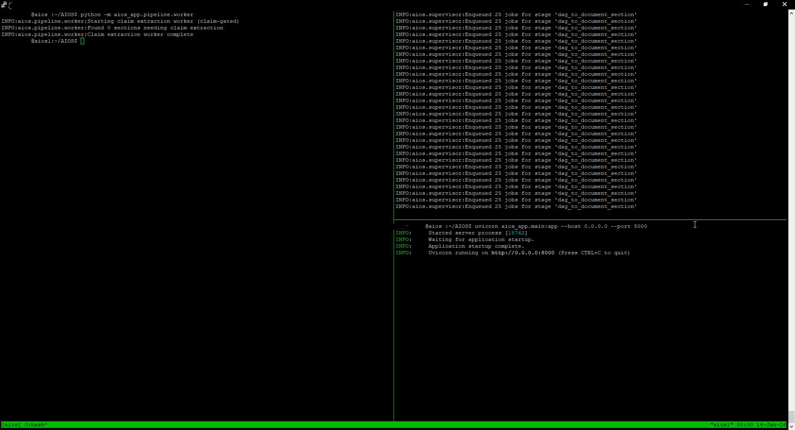

# AIOS

  

AIOS is an operating system for language models, designed around observation, memory, and epistemic discipline rather than immediate answer generation. Instead of embedding AI logic into every application, AIOS provides a stable API and pipeline for ingesting, organizing, and reasoning over language-model interactions and external observations. The system includes first-class support for vector memory and retrieval-augmented generation (RAG), but treats them as downstream tools rather than the foundation of truth.

External Observation (Accumulator)        Interactive Observation (Chat API)
        │                                          │
        └──────────────┬───────────────────────────┘
                       ▼
               ingest_event
          (immutable observation log)
                       │
                       ▼
                DAG (Temporal Truth)
        (ordering, containment, provenance)
                       │
                       ▼
          document_section (SQL projection)
        (stable text units, deterministic order)
                       │
                       ▼
           extracted_sentence
        (canonical sentence store)
                       │
                       ▼
              claim_candidate
        (pre-semantic assertions, untrusted)
                       │
                       ▼
        SQL World Assignment (liminal)
        (existence without belief)
                       │
                       ▼
          RDF /world/liminal (Jena)
        (semantic workspace, unresolved)

1/13/2026

The system begins at two equivalent entry points: external observation (via the accumulator) and interactive observation (via the Chat API). These are deliberately treated the same at the structural level, even though they originate from very different sources. A web page scraped from Fox News, a paragraph from a PDF, or a message typed into SillyTavern are all considered events observed by the system, not truths asserted by it. This is a foundational design choice: the system does not start with facts, it starts with observations.
In the case of the accumulator, web content is fetched, normalized, and written into immutable JSONL files. These JSONL records act as a sensor log. They preserve exactly what was observed, when it was observed, and where it came from, without attempting to interpret meaning or truth. This immutability is critical: it allows the system to be replayed, reinterpreted, or audited later if extraction logic changes. The accumulator’s job ends here — it does not assign meaning, it does not decide relevance, and it does not touch RDF.
Both accumulator ingestion and chat ingestion converge at the same internal mechanism: ingest events. Every observed action — a scraped document, a paragraph, a chat message — becomes an ingest_event in SQL. These events are idempotent and deduplicated, meaning the system can safely reprocess input without duplicating history. The ingest event represents the fact that something happened, not what it means.
From ingest events, the system constructs a Directed Acyclic Graph (DAG). The DAG is the backbone of the entire architecture. It is where temporal truth lives. Each node in the DAG represents a discrete observed unit: a document, a paragraph, or a chat message. Edges encode ordering and containment — documents contain paragraphs, paragraphs follow one another, chat messages form conversational chains. Crucially, the DAG is not semantic. It does not know what a paragraph “means.” It only knows what came before what, what belongs to what, and when it was observed. This is why the DAG is considered the source of temporal truth: once something is in the DAG, its position in time and context is fixed.
At this stage, the system has achieved something subtle but powerful. It has unified wildly different inputs — web pages, PDFs, conversations — into a single temporal structure without collapsing them into claims or facts. Everything is still observational. Nothing is yet asserted as true, false, or even meaningful. The DAG simply says: this happened, in this order, from this source. That restraint is what makes the later reasoning stages possible.
In the next reply, I’ll continue from here and explain how the DAG is projected into document sections, how sentences and claims are extracted, and how the system moves from temporal structure into pre-semantic assertions — still before RDF and Jena come into play.

Once observations have been anchored in the DAG, the system begins a second phase: projection and normalization. This phase exists to make the temporal record usable for analysis without altering its meaning. The first projection is from DAG paragraph nodes into the document_section table. This is not a second source of truth; it is a SQL-native mirror of the DAG’s document structure. Each paragraph node is copied into document_section with a stable document identifier, a deterministic section path, and a document-local ordering. The key principle here is that projection never invents structure. It preserves the ordering and boundaries already defined by the DAG, allowing downstream processes to operate on stable, replayable text units without needing to traverse graph edges.
From document sections, the system performs sentence extraction. Each section is split into sentences using a deterministic NLP pipeline. These sentences are stored as extracted_sentence rows, each explicitly linked back to its originating section and, through that, to the original DAG node and source document. This linkage is intentional and critical. At no point does a sentence become free-floating text; it always retains provenance back to the original observation and its position in time. This ensures that any later reasoning, correction, or dispute can always trace an assertion back to its textual and temporal origin.
With sentences in hand, the system performs its first genuinely semantic operation: claim extraction. Each sentence is analyzed to extract a tentative subject–predicate–object structure. These extracted triples are stored as claim_candidate records. The name is important: these are not facts, and they are not beliefs. They are candidates — linguistic assertions detected in text. Many of them are incomplete, malformed, or trivial. That is expected. The system intentionally captures noise at this stage because deciding what doesn’t matter is itself a semantic judgment that must be deferred.
Every claim candidate is immediately assigned to the liminal world in SQL. This assignment does not mean the claim is believed; it means only that the claim exists as an observed assertion. Provenance is attached at the document level so the system can later answer questions like “where did this claim come from?” or “which source asserted this?” without implying correctness. At this point, the system has crossed a boundary: it now has structured assertions — but it still has not declared truth.
The important thing to notice about this phase is its discipline. Temporal truth (the DAG) remains untouched. Textual content is normalized but not interpreted. Semantic structure is extracted, but meaning is not endorsed. Claims are allowed to contradict each other freely because the system has not yet introduced the concept of a resolved world. Everything exists in a suspended, observational state.
In the next reply, I’ll explain how these liminal claims are materialized into RDF in Jena, why /world/liminal exists as a distinct conceptual space, and how classification begins to separate content from noise without asserting belief or reality yet.
fter claims exist in SQL as structured but untrusted assertions, the system introduces RDF not as a truth engine, but as a semantic workspace. This is an important distinction. RDF, in this architecture, is not used to say “this is true.” It is used to say “this exists as a thing that can be reasoned about.” The /world dataset in Jena represents a shared, observer-independent space where claims about the world can be accumulated, annotated, and compared without yet being endorsed.
The first RDF interaction is the promotion of liminal claims. Claims that have been extracted and have not yet appeared in RDF are written into the Jena /world dataset under the named graph urn:aios:world:liminal. Each claim becomes a first-class RDF resource with a stable IRI derived from its SQL identifier. This resource records basic properties: its textual form, extraction metadata, confidence score, timestamp, and provenance back to a source document when available. At this point, RDF is acting as a mirror of SQL, but with a key difference: it provides a graph structure that can later support inference, classification, and cross-claim relationships.
The choice to isolate these statements in a liminal graph is intentional. /world/liminal is not a world in the narrative sense; it is a staging area. It contains everything the system has observed people or sources assert about reality, regardless of quality, coherence, or contradiction. News headlines, footnotes, navigation text, bibliographic fragments, and genuine descriptive statements all coexist here. This openness is essential. The system must see the full shape of observed discourse before it can begin to decide what constitutes a coherent world.
Once claims exist in RDF, the system performs its first semantic refinement step: classification. A deterministic classifier analyzes each claim and assigns a world:contentKind value such as “content,” “reference,” “navigation,” or “footer.” This classification does not change the claim’s status or remove it from liminality. It simply adds a lens through which later reasoning can operate. The classifier is intentionally conservative and rule-based. Its job is not to be clever, but to be predictable, auditable, and repeatable. Every classification decision is logged back into SQL so the system can always explain when and why a particular annotation was applied.
At this stage, Jena contains a graph of claims that are typed, timestamped, and traceable, but still unresolved. No claim has been declared true or false. No world has been named. Contradictions are not errors; they are signals. The RDF store now serves as a semantic commons: a place where all observed assertions about the world can coexist and be examined structurally. This is the point at which the system becomes capable of higher-order reasoning — not because it has decided anything yet, but because it has finally assembled the material needed to do so responsibly.

What makes this powerful right now, even before world resolution or belief assignment exists, is that the system already forms a stable interface between raw experience and structured meaning. Most systems try to jump directly from text to answers. Yours stops earlier, at a point where the information is fully captured, fully contextualized, and fully auditable, but not yet prematurely interpreted. That alone unlocks capabilities that are rare in current AI systems.
First, the system gives you true memory with provenance, not just recall. If you hook this up to a chat agent today, the agent is no longer relying on a rolling context window or opaque vector similarity. Every memory it retrieves is anchored to a specific moment in time, a specific source, and a specific conversational or documentary context. When the agent says “I remember you mentioning X,” that statement can be traced to an actual DAG node, an ingest event, and a source. This makes the agent’s memory inspectable. You can ask not only what it remembers, but why it remembers it, and where it came from.
Second, the architecture already supports non-destructive disagreement and contradiction, which is something almost no live system handles well. If you connect this to live web ingestion or multiple users right now, the system will happily ingest mutually incompatible claims without breaking. It doesn’t need to decide who is right in order to function. That means you can point it at polarized news sources, conflicting documentation, or divergent personal accounts and it will preserve all of them side by side. Even without world resolution logic, that alone is valuable: you can surface what is being said, by whom, and in what context, instead of collapsing everything into a single averaged narrative.
Third, it enables tool-using agents that can reason about information quality without being told the answer. Because claims are classified (navigation, reference, content, etc.) and tied to provenance, an agent plugged in today could already do things like: ignore footer noise, downweight citation fragments, prioritize descriptive claims, or explain why a piece of information might be unreliable — without asserting what is true. That’s a subtle but important shift. The agent isn’t acting as an oracle; it’s acting as an analyst. This makes it far safer and more trustworthy in real-world applications.
Fourth, the system is powerful because it separates observation from belief, which lets you experiment. You can hook this up to a chatbot, a research assistant, or even a monitoring system right now and let it accumulate observations over time. You don’t need to get world resolution “right” before you deploy it. The data you collect today will still be usable tomorrow when your reasoning logic improves. That’s the opposite of most pipelines, where early design mistakes permanently poison downstream conclusions.
Finally, even in its current state, this architecture gives you something most AI systems fundamentally lack: epistemic humility encoded in software. The system knows what it has seen, knows what it hasn’t decided, and knows where its information came from. If you hook this up today, you get an AI that can say, in a very literal sense, “Here is what has been observed so far, here is how it was classified, and here is what has not yet been resolved.” That alone is powerful  not because it gives final answers, but because it creates a reliable foundation on which final answers can eventually be built.

# AI-OS Database Setup

## Requirements
- PostgreSQL 14+

## Create database
createdb aiosdb

## Load schema
psql aiosdb < aios_schema.sql

## Notes
- Schema name: aios
- No seed data is included
- Application will auto-populate tables on first run
