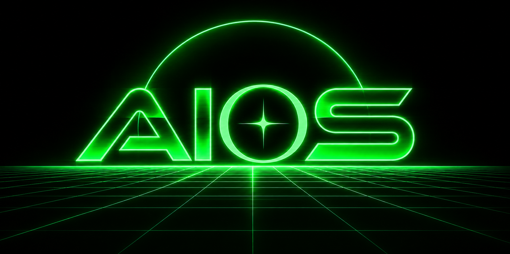
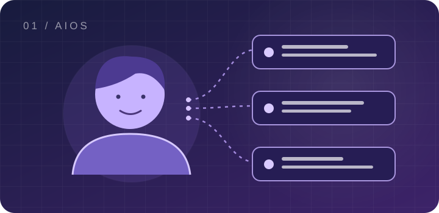
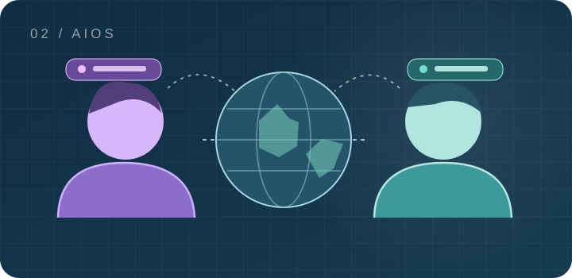
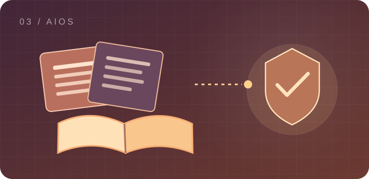
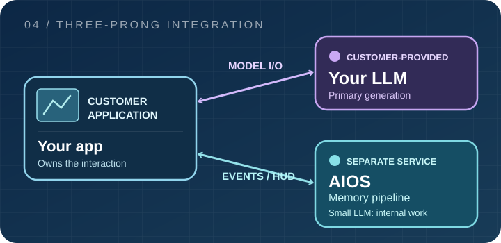
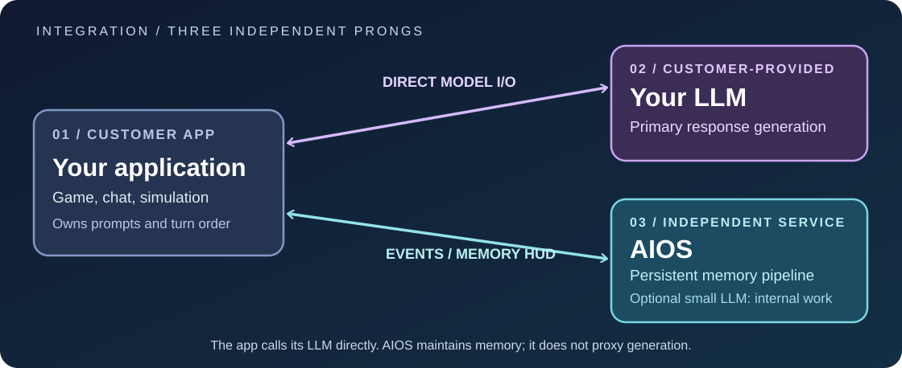

<p align="center">
  
</p>

<h1 align="center">AIOS</h1>

<p align="center"><strong>Persistent memory and world state for AI agents.</strong></p>
<p align="center">
  Give an existing LLM continuity beyond a single prompt or chat.
  AIOS maintains identity, experience, individual knowledge and belief, scene state,
  and world state outside the language model, then prepares relevant context for its next turn.
</p>

<p align="center">
  <a href="#what-can-you-build">What can you build?</a> ·
  <a href="#quick-start">Quick start</a> ·
  <a href="#connect-your-application">Connect an app</a> ·
  <a href="docs/README.md">Developer docs</a> ·
  <a href="#how-aios-works">How it works</a>
</p>

> **Development status:** Experimental and under active development; interfaces may change.
> **License:** Source-available under the [AIOS Personal Use License 1.0](LICENSE).
> Personal use by natural persons is permitted; commercial and organizational use requires a separate written license.

## What can you build?

AIOS can act as the persistent-state component behind a chat application, game, simulation,
or agent project. You keep control of the interface and model; AIOS tracks continuity.

<table>
  <tr>
    <td width="50%" valign="top">
      
      <h3>Persistent characters and companions</h3>
      <p>Give an agent an enduring identity and a history of interactions. Record events, resume conversations, and retrieve relevant experience instead of treating every generation as a clean slate.</p>
    </td>
    <td width="50%" valign="top">
      
      <h3>Separate perspectives in one world</h3>
      <p>Run multiple characters in a shared world without automatically assigning everyone the same memories or beliefs. Track individual experiences alongside shared world information.</p>
    </td>
  </tr>
  <tr>
    <td width="50%" valign="top">
      
      <h3>Knowledge-aware agents <em>(experimental)</em></h3>
      <p>Import documents into a searchable corpus and intentionally acquire selected material into an actor's knowledge path, with source information retained. Importing a document is not the same as making every agent know it.</p>
    </td>
    <td width="50%" valign="top">
      
      <h3>Stateful application integrations</h3>
      <p>Your application calls its chosen LLM directly and connects independently to AIOS for persistent memory and a prepared HUD. AIOS can use smaller inference workers for its own internal cognitive processing; it is not a proxy for your primary model.</p>
    </td>
  </tr>
</table>

<sub>Illustrations are conceptual, not screenshots of tested application scenarios.</sub>

## See the integration work

AIOS already includes a dependency-free Python example that creates or resumes a session,
sets up two participants, ingests a message, and prints an up-to-date **HUD** (the context
package intended for the next model generation).

With AIOS running, execute from the repository root:

```bash
python3 examples/live_client.py --conversation readme-demo-001 --turn 1 \
  --message 'The brass key is on the kitchen table.'
```

To also record a model response, supply its actual text:

```bash
python3 examples/live_client.py --conversation readme-demo-002 --turn 1 \
  --message 'The brass key is on the kitchen table.' \
  --reply 'I will look for the brass key on the kitchen table.'
```

This example exercises the AIOS HTTP lifecycle; **it does not invoke an LLM on your behalf**.
Replace its marked model-call section with your preferred provider. Keep the conversation key
stable across reconnects, and advance `--turn` for each new exchange. A complete two-agent
continuity demonstration and clean-host end-to-end validation remain release work.

See the [full integration walkthrough](docs/integration.md) for copy-paste curl commands and
the [Python client source](examples/live_client.py) for readiness, retry, and conflict handling.
The [MemoryVaultIngest SillyTavern extension](https://github.com/LeetHappyfeet/extension-MemoryVaultIngest)
is an example of a live AIOS client.

## Quick start

**Requirements:** Linux/Bash environment, Python 3.10+, Git, and Docker with Compose v2.
The provided scripts target Linux; on Windows use a Linux environment such as WSL with Docker access.
The installer starts PostgreSQL, Qdrant, and Apache Jena Fuseki and prepares the Python environment.

```bash
git clone --branch AIOS-development https://github.com/LeetHappyfeet/AIOS.git
cd AIOS
bash setup.sh
bash run.sh
```

Wait for the launcher to report:

```text
✅ AIOS READY
   Required services: 4/4 ready
```

| Where | Default local address |
|---|---|
| Web interface | `http://127.0.0.1:7860` |
| HTTP API | `http://127.0.0.1:8000` |
| Interactive API reference | `http://127.0.0.1:8000/docs` |
| OpenAPI schema | `http://127.0.0.1:8000/openapi.json` |

Check API health:

```bash
curl --fail-with-body http://127.0.0.1:8000/healthz
# {"ok":true}
```

Then run the example above. To stop native processes, press `Ctrl+C`; to also stop
the Compose services, run `bash stop.sh`. Persistent volumes are preserved.
**Do not run `docker compose down -v` unless you intend to delete the databases.**

See [installation and troubleshooting](docs/installation.md) for the complete setup contract,
existing-installation cautions, and configuration options. The [Colab demo](https://colab.research.google.com/drive/1c-eaLVuAu76JSgD4-rr65WvPFwzXA1zK?usp=sharing)
is an alternative experimental introduction.

## Connect your application

<p align="center">
  
</p>

AIOS is an independent HTTP JSON **memory pipeline**, not an LLM proxy. Your application owns its
UI, turn ordering, and direct calls to the customer-provided model. Separately, it sends observations
and generated replies to AIOS and retrieves the memory HUD to include in its own model prompt.
Optional small-model inference workers inside AIOS support its internal cognitive/semantic work;
they do not replace or sit in front of the application’s primary LLM.

The normal live-agent sequence is:

1. `POST /session` — create or resume an external conversation using stable `source` and `source_session_id`.
2. Bootstrap both participant identities, then `POST /character/{character_id}/activate` for each actor in the intended shared world.
3. `POST /ingest` — record the incoming message with explicit speaker/recipient IDs and a unique logical-message `dedupe_key`.
4. `POST /instance/{instance_id}/hud?through_node_id={node_id}` — use the `node_id` from ingestion, and check `generation_ready` before invoking your model.
5. **Your application** sends the prepared HUD `text` alongside its own instructions directly to **your LLM**. The application then records the generated reply separately through AIOS `POST /ingest`.

For example, once the [tutorial's participant setup](docs/integration.md) has supplied
`SESSION` and `INSTANCE`, a typical user-message body looks like this:

```json
{
  "session_id": "<SESSION UUID>",
  "character_id": "docs-guide",
  "user_name": "docs-human",
  "scope_key": "conversation",
  "speaker_type": "user",
  "speaker_id": "docs-human",
  "recipient_id": "docs-guide",
  "kind": "chat_message",
  "text": "The brass key is on the kitchen table.",
  "payload": {"source": "developer-demo"},
  "dedupe_key": "readme-demo:turn-1:user:revision-1"
}
```

Its response includes `node_id`. Pass that exact coordinate to the HUD endpoint:

```bash
curl --fail-with-body -sS -X POST \
  "http://127.0.0.1:8000/instance/$INSTANCE/hud?through_node_id=$NODE&wait_ms=2500"
```

Use `hud["text"]` only when `generation_ready` is true for the current source coordinate.
Ingestion success alone does not imply asynchronous enrichment or HUD preparation has finished.
A stale-coordinate HTTP 409 is a state conflict, not a reason to silently fall back to old memory.
The [complete, executable curl walkthrough](docs/integration.md) fills in the setup and identifiers;
the [API guide](docs/api.md) documents requests, responses, and error handling.

**Network safety:** The current development API has no common authentication scheme and
its application-host default binds to `0.0.0.0`. For same-machine use, explicitly set
`AIOS_API_HOST=127.0.0.1`. Put an authenticated access boundary in place before exposing
the service to another device or network. CORS is not authentication.

## How AIOS works

AIOS stores more than similar passages of text. It distinguishes **who an agent is**,
**what happened**, **what each participant knows or believes**, **what belongs to the world**,
and **what is happening in the current scene**. The **HUD** assembles the portion needed for
the next generation while the larger state remains persistent.

A conventional retrieval-augmented generation (RAG) system primarily retrieves similar
stored text. Similarity alone cannot determine chronological order, identity, source authority,
or whether one character has actually learned information known to another. AIOS uses vector
search as one component of a broader state and evidence pipeline.

<details>
<summary><strong>Architecture and storage responsibilities</strong></summary>

- **PostgreSQL:** Durable memory, source provenance, timelines, experiences, knowledge and belief state, runtime and pipeline state.
- **Apache Jena Fuseki:** RDF representations of world and character knowledge.
- **Qdrant:** Semantic candidate discovery and retrieval acceleration.
- **AIOS runtime:** Ingestion, semantic processing, HUD preparation, world and character state, agent tasks, actions, and inference coordination.

Identity is maintained separately from ordinary conversational memory. Accepted material
contributes to a provenance-backed Identity Kernel rather than letting a transient
utterance silently redefine the character. The shared corpus can hold documents without
automatically making them part of every actor's knowledge.

Agent cognition, inference workers, and external knowledge acquisition are experimental.
Persistent state does not require your application to surrender control of its model calls.

</details>

## Documentation

| I want to… | Start here |
|---|---|
| Install or troubleshoot AIOS | [Installation](docs/installation.md) |
| Connect a chatbot, game, or external program | [First integration tutorial](docs/integration.md) and [example client](examples/live_client.py) |
| Look up HTTP requests, responses, and errors | [API guide](docs/api.md) or the running `/docs` endpoint |
| Operate services or configure inference | [Runtime operations](docs/runtime.md) |
| Inspect a message, missing memory, or failed job | [Inspection and troubleshooting](docs/inspection.md) |
| Understand the internal design | [Architecture](docs/architecture.md), [Identity Kernel](docs/identity_kernel.md), [Belief Reconciliation](docs/belief_reconciliation.md), and [Causal Integrity](docs/causal_integrity.md) |
| Explore further subsystems | [Semantic Index](semantic_index/README.md), [Plugin System](plugins/README.md), and [RDF Ontology](rdf/ontology/readme.md) |

## Development and license

AIOS remains experimental. Internal schemas, APIs, memory and belief policies, and cognition
components are actively evolving. Pin the commit used by your integration and export that
server's `/openapi.json` before upgrading. Reports accompanied by logs and a reproducible
source interaction are welcome.

AIOS is **source-available proprietary software**, not open-source software. Personal use,
study, experimentation, and private modification by natural persons are permitted under the
[AIOS Personal Use License 1.0](LICENSE). Commercial, organizational, institutional, hosted,
and service-provider use requires a separate written license. Earlier versions released under
Apache License 2.0 retain the license applicable to those versions.
